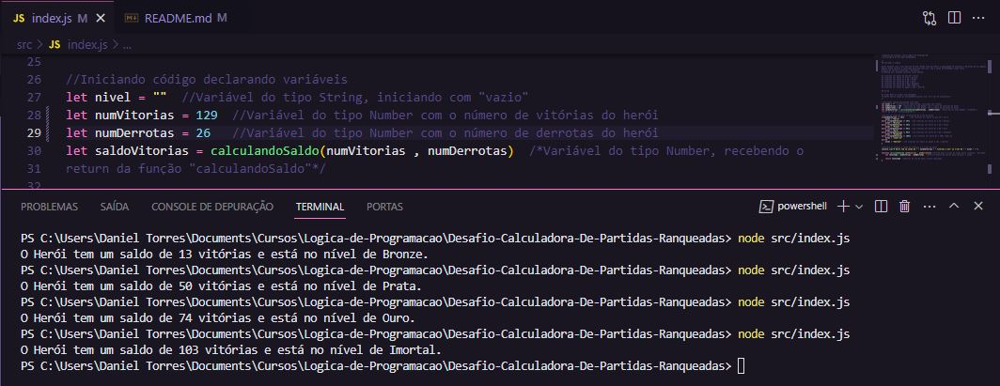

# Desafio-Calculadora-De-Partidas-Ranqueadas

Neste repositório irei descrever um novo projeto que fiz para o curso Lógica de Programação.

Instrutor: Felipão [DIO.me](https://www.dio.me/)

## Desafio

### Entradas e Lógica

Neste desafio irei criar uma função que recebe como parâmetro a quantidade de vitórias e derrotas de um jogador, depois disso retorna o resultado para uma variável, com o saldo de Rankeadas sendo feito através do calculo (vitórias - derrotas).
O Ranking será exibido conforme lista abaixo:

- Se vitórias for menor do que 10 = Ferro
- Se vitórias for entre 11 e 20 = Bronze
- Se vitórias for entre 21 e 50 = Prata
- Se vitórias for entre 51 e 80 = Ouro
- Se vitórias for entre 81 e 90 = Diamante
- Se vitórias for entre 91 e 100= Lendário
- Se vitórias for maior ou igual a 101 = Imortal

### Saída

Ao final deve se exibir uma mensagem:
"O Herói tem de saldo de **{saldoVitorias}** está no nível de **{nivel}**"
*/

## Criando Repositório

Primeiramente criei o repositório no __GitHub__ com nome __"Desafio-Calculadora-De-Partidas-Ranqueadas"__ e clonei o repositório para meu PC utilizando o __GitHub Desktop__.

## Abrindo Visual Studio Code

Para este projeto eu utilizei o __VS Code da Microsoft__, que é gratuito e fácil de usar. É minha segunda experiência com criação de códigos, mas graças aos vídeos das aulas estou progredindo.

## Criando o Projeto

Após VS Code aberto, criei a pasta __"src"__ e dentro dela criei o arquivo __"index.js"__, aonde irei criar o código em __JavaScript__. Também não tenho conhecimento em __JavaScript__, portanto, todos os conhecimentos que irei utilizar são os que eu aprendi até agora.

## Código

- Inicialmente criei quatro variáveis, sendo uma do tipo __String__ e três do tipo __Number__, conforme código abaixo.

```
let nivel = ""
let numVitorias = 90
let numDerrotas = 10
let saldoVitorias = calculandoSaldo(numVitorias , numDerrotas)
```
- Após variáveis criadas, criei uma função chamada __"calculandoSaldo"__, que realiza uma subtração das variáveis __"numVitorias"__ __-__ __"numDerrotas"__ e retorna o __"resultado"__ desta operação aritmética.
Lembrando que dentro da função __"calculandoSaldo"__ existem variáveis que são utlizadas somente dentro da função. O código pode ser visto abaixo:

```
function calculandoSaldo (qtdVitorias , qtdDerrotas){ //Função para cálculo de saldo entre vitórias - derrotas
    let resultado = qtdVitorias - qtdDerrotas  //Variável dentro da função para calcular o saldo

    return resultado
}
```

- Depois que a função e as variáveis foram criadas, utilizei a estrutura de condição __IF__ para testar as condições mencionadas acima, conforme código abaixo:

```
if(saldoVitorias <= 10){
    nivel = "Ferro"
}else if(saldoVitorias <= 20){
    nivel = "Bronze"
}else if(saldoVitorias <= 50){
    nivel = "Prata"
}else if(saldoVitorias <= 80){
    nivel = "Ouro"
}else if(saldoVitorias <= 90){
    nivel = "Diamante"
}else if(saldoVitorias <= 100){
    nivel = "Lendário"
}else{
    nivel = "Imortal"
}
```

- Finalizando o código, chamei a função __"console.log()"__ para exibir no terminal o conteúdo pedido no desáfio de projeto.

```
console.log("O Herói tem um saldo de " + saldoVitorias + " vitórias e está no nível de " + nivel + ".")
```

## Testando Código

Neste teste verifiquei se a lógica estava correta e para isso, escrevi nas variáveis __"numVitorias"__ e __"numDerrotas"__ 4 valores diferentes listados abaixo e acompanhando no terminal do __VS Code__ cada resultado testado. O código está funcionando corretamente, conforme imagem também abaixo:

- Vitórias = 30; Derrotas = 17
- Vitórias = 50; Derrotas = 00
- Vitórias = 85; Derrotas = 11
- Vitórias = 129; Derrotas = 26




## Conclusão

Este foi o meu segundo projeto de __Lógica de Programação__ e fiquei muito feliz com o resultado.
Testei algumas outras formas de escrever o código mas a que está no repositório é a que eu achei mais fácil de fazer e entender. Espero que tenha ficado bom.

## Linguagens de Marcação e Programação

- 

- 

## Ferramentas e Serviços

- 

- 

- 

- 